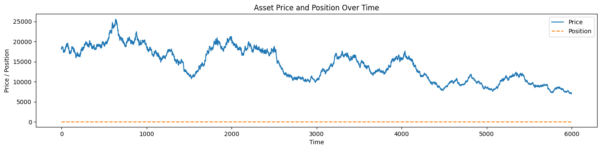

# Quantitative Trading Strategy Backtest

This project develops and tests trading alphas for the Indian and US equity markets, focusing on medium to high-frequency trading strategies. The objective is to create, backtest, and optimize these alphas to enhance trading performance.

## Project Overview

### Features
- Develop trading strategies based on given alphas
- Backtest strategies using historical market data
- Optimize trading thresholds to maximize profit and loss (PnL)
- Visualize the performance of the trading strategies

## Getting Started

### Prerequisites
- Python 3.x
- Pandas
- Numpy
- Matplotlib

### Installation
1. Clone the repository:
   ```sh
   git clone https://github.com/saurabh4269/alpha.git
   cd alpha
   ```

2. Install the required packages:
   ```sh
   pip install pandas numpy matplotlib
   ```

3. Download the dataset from the provided link and place it in the project directory:
   - [Dataset](https://drive.google.com/drive/folders/16axvSf2EcE54KH1VIrzoOX-O72tiHFpP?usp=sharing)
   - Rename the downloaded file to `asset_1.csv` and place it in the project directory.

## Usage

1. Run the script:
   ```sh
   python backtest.py
   ```

2. The script will:
   - Load the dataset
   - Optimize the trading thresholds
   - Apply the optimal strategy
   - Backtest the strategy
   - Save the results to `backtest_results.csv`
   - Visualize the performance

## Script Overview

### Classes

#### `TradingStrategy`
- **Initialization**: Accepts build and liquidate thresholds.
- **Method**: `apply_strategy(data)` applies the trading strategy to the dataset.

#### `BacktestEngine`
- **Initialization**: Accepts a strategy and dataset.
- **Method**: `run_backtest()` applies the strategy, calculates returns and PnL, and generates a cumulative PnL.

### Functions

#### `optimize_thresholds(data)`
- Optimizes the build and liquidate thresholds to maximize PnL.

#### `visualize_backtest_results(data)`
- Visualizes the asset price, position over time, and cumulative PnL.

### Script Execution

- The script first optimizes the thresholds.
- It then applies the optimal strategy and runs the backtest.
- Finally, it visualizes the results and saves them to a CSV file.

## Visualization

Below are example plots generated by the script:

### Asset Price and Position Over Time



### Cumulative PnL Over Time


